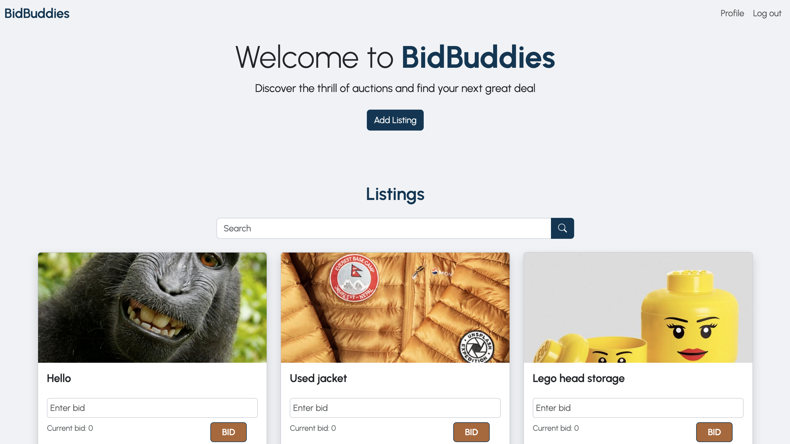

# BidBuddies - Semester Project 2



## Description

[BidBuddies](https://bid-buddies.netlify.app/index.html) is an engaging online auction marketplace where users can participate in auctions by bidding on items or listing their own items for auction. Each new user starts with 1000 credits, which they can use to bid on items or accumulate by selling their own. While anyone can browse through the listings, only registered users have the privilege to place bids and view detailed listing information, making it a vibrant community for buying and selling.

### Features:

- **User-Friendly Interface:** Simple and intuitive design powered by Bootstrap.
- **Auction System:** Users can bid on items, with credits being the primary currency.
- **Search Functionality:** Non-registered users can search through listings.
- **Credits Management:** Users gain credits by selling items and spend them by purchasing through bids.

### Built With:

- **Vanilla JavaScript:** Core logic and interactions.
- **Bootstrap:** Responsive and modern design.
- **Noroff Auction API V2:** Back-end data handling and integration.

## Getting Started

Follow these steps to set up and run the project locally:

1. **Clone the repository:**

   ```sh
   git clone https://github.com/EVeskje/BidBuddies-sp2.git

   ```

2. `cd BidBuddies-sp2`

3. `npm install`

4. Run the project locally
   `npm start`

   ## Contributing

Contributions are welcome and appreciated! Here’s how you can get involved:

- Submit a Pull Request:
  If you’ve made improvements or fixed bugs, please submit a pull request. Make sure your code adheres to the project’s coding standards.

- Report an Issue:
  If you find any issues or have ideas for enhancements, create an issue in the repository. Please provide detailed information to help with troubleshooting or development.

## Contact

Feel free to reach out if you have any questions or want to connect:

- **[Portfolio](https://portfolio-env.netlify.app/):** Check out my other projects and professional work.
- **[LinkedIn](https://www.linkedin.com/in/env-link/):** Connect with me on LinkedIn for professional networking.
